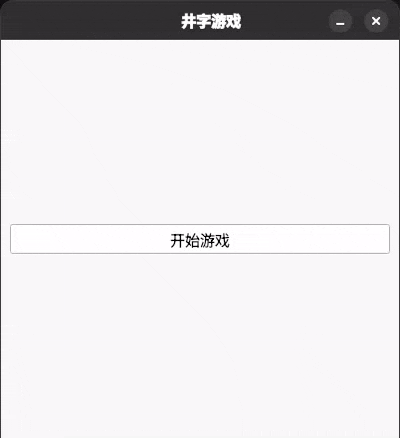

# TicTacToe-App
使用 PySide6 开发的井字棋（Tic-Tac-Toe）游戏。

这是一个用 Python 编写的双人井字棋游戏，作为练习项目用于巩固基础编程技能。游戏桌面上运行，支持两名玩家轮流在 3×3 的棋盘上放置 “X” 和 “O”，程序会自动检测胜负、无效操作和平局情况。

## 功能特性

- **双人本地对战模式**：两名玩家在同一设备上轮流操作  
- **自动胜负与平局判定**：实时判断游戏是否结束  
- **防止无效操作**：无法在已被占据的位置落子  
- **简洁清晰的游戏循环**：逻辑清晰，易于理解和扩展  
- **直观的文本棋盘显示**：使用纯文本展示当前棋盘状态